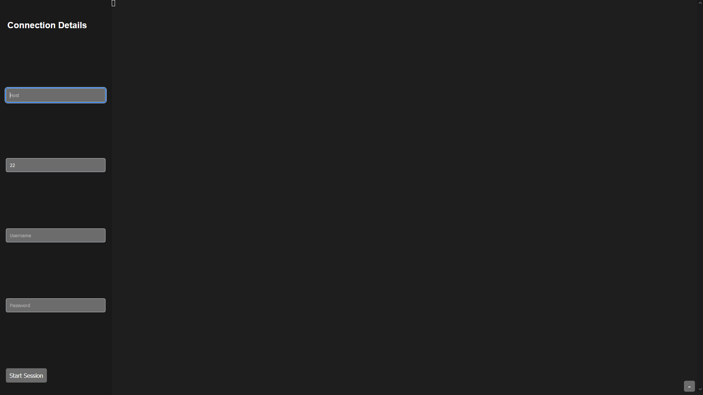

# Repo Stats

#### Top Technologies

 

  

# Overview
Termix is an open-source forever free self-hosted SSH (other protocols planned, see [Planned Features](#planned-features)) server management panel inspired by [Nexterm](https://github.com/gnmyt/Nexterm). Its purpose is to provide an all-in-one docker-hosted web solution to manage your servers in one easy place. I'm using this project to help me learn [React](https://github.com/facebook/react), [Vite](https://github.com/vitejs/vite-plugin-react), and [Docker](https://www.docker.com) but also because I could never settle on a server management software that I enjoyed to use.

> [!WARNING]  
> This app is in the VERY early stages of development. Expect bugs, data loss, and unexplainable issues! For that reason, I recommend you securely tunnel your connection to Termix through a VPN.

# Features
- SSH
- Split Screen (Up to 4) & Tab System

# Planned Features
- Database to Store Connection Details
- VNC
- RDP
- SFTP (build in file transfer)
- ChatGPT/Ollama Integration (for commands)
- Login Screen
- User Management
- Apps (like notes, AI, etc)

# Installation
Visit the Termix [Wiki](https://github.com/LukeGus/Termix/wiki) for information on how to install Termix. You can also use these links to go directly to guide. [Docker](https://github.com/LukeGus/Termix/wiki/Docker) or [Manual](https://github.com/LukeGus/Termix/wiki/Manual).

# Support
If you need help with Termix, you can join the [Discord](https://discord.gg/jVQGdvHDrf) server and visit the support channel. You can also open an issue or open a pull request on the [GitHub](https://github.com/LukeGus/Termix/issues) repo.

# Show-off

# License
Distributed under the MIT license. See LICENSE for more information.
